# 🔗 Phase 3: Causal Correlation Tracking - Revolutionary Design

**Date**: December 25, 2025
**Status**: 🚀 Design Phase - Ready for Implementation
**Impact**: **REVOLUTIONARY** - Transform from event logging to causal understanding

---

## Executive Summary

**Current State**: We have comprehensive event logging (6 hooks, 14 tests, 100% success)
**Gap**: Events are isolated - no way to understand causality or relationships
**Solution**: Causal Correlation Tracking System
**Impact**: From "what happened?" to "why did it happen?" and "what caused what?"

---

## The Problem: Isolated Events

### Current Trace Structure
```json
{
  "events": [
    {"type": "phi_measurement", "phi": 0.08},
    {"type": "router_selection", "selected_router": "FastPattern"},
    {"type": "language_step", "step_type": "response_generation"}
  ]
}
```

**Questions We CAN'T Answer**:
- ❌ Did the Φ measurement influence the routing decision?
- ❌ Which security check led to this error?
- ❌ What was the complete causal chain from input to output?
- ❌ Which events are independent vs dependent?

---

## The Solution: Causal Correlation IDs

### Enhanced Event Structure
```json
{
  "events": [
    {
      "id": "evt_001",
      "parent_id": null,
      "correlation_id": "req_abc123",
      "type": "phi_measurement",
      "phi": 0.08,
      "caused_by": [],
      "causes": ["evt_002"]
    },
    {
      "id": "evt_002",
      "parent_id": "evt_001",
      "correlation_id": "req_abc123",
      "type": "router_selection",
      "selected_router": "FastPattern",
      "caused_by": ["evt_001"],
      "causes": ["evt_003"]
    },
    {
      "id": "evt_003",
      "parent_id": "evt_002",
      "correlation_id": "req_abc123",
      "type": "language_step",
      "caused_by": ["evt_002"],
      "causes": []
    }
  ],
  "causal_graph": {
    "nodes": ["evt_001", "evt_002", "evt_003"],
    "edges": [
      {"from": "evt_001", "to": "evt_002", "strength": 0.95},
      {"from": "evt_002", "to": "evt_003", "strength": 1.0}
    ]
  }
}
```

**Questions We CAN Answer**:
- ✅ evt_001 (Φ=0.08) caused evt_002 (routing decision) with 95% confidence
- ✅ The complete causal chain: phi → routing → response
- ✅ evt_001 and evt_003 are independent (no direct causal link)
- ✅ All events in this trace belong to request "req_abc123"

---

## Core Design

### 1. Event Identity System

**Every event gets**:
- `id`: Unique event identifier (`evt_` + UUID)
- `correlation_id`: Groups related events (e.g., all events for one request)
- `parent_id`: Direct causal parent (optional)
- `timestamp`: When the event occurred
- `duration_ms`: How long the event took (optional)

**Example**:
```rust
pub struct EventMetadata {
    pub id: String,                    // "evt_550e8400-e29b-41d4-a716-446655440000"
    pub correlation_id: String,        // "req_abc123" or "session_xyz"
    pub parent_id: Option<String>,     // "evt_parent123" or None
    pub timestamp: DateTime<Utc>,      // 2025-12-25T04:30:00Z
    pub duration_ms: Option<u64>,      // 15 (milliseconds)
    pub tags: Vec<String>,             // ["security", "critical"]
}
```

### 2. Correlation Context Manager

**Purpose**: Track active correlation chain as events occur

```rust
pub struct CorrelationContext {
    correlation_id: String,
    parent_stack: Vec<String>,  // Stack of parent event IDs
    event_chain: Vec<String>,   // All events in this correlation
}

impl CorrelationContext {
    /// Start new correlation (e.g., new request)
    pub fn new(correlation_id: impl Into<String>) -> Self;

    /// Push new parent (entering nested operation)
    pub fn push_parent(&mut self, event_id: impl Into<String>);

    /// Pop parent (exiting nested operation)
    pub fn pop_parent(&mut self) -> Option<String>;

    /// Get current parent (for setting parent_id)
    pub fn current_parent(&self) -> Option<&str>;

    /// Get correlation ID (for grouping related events)
    pub fn correlation_id(&self) -> &str;

    /// Create event metadata with proper lineage
    pub fn create_event_metadata(&self) -> EventMetadata;
}
```

**Usage Example**:
```rust
// Start new request
let mut ctx = CorrelationContext::new("req_user_query_42");

// Measure Φ (top-level event)
let phi_event_id = ctx.create_event_metadata();
phi_calc.compute_phi_with_context(&state, &ctx);
ctx.push_parent(phi_event_id.id);  // Φ is now parent

// Route (child of Φ measurement)
let routing_event_id = ctx.create_event_metadata();  // parent_id = phi_event_id
router.route_with_context(&computation, &ctx);
ctx.push_parent(routing_event_id.id);  // Routing is now parent

// Generate response (child of routing)
let response_event_id = ctx.create_event_metadata();  // parent_id = routing_event_id
generator.generate_with_context(&input, &consciousness, &ctx);

ctx.pop_parent();  // Exit routing context
ctx.pop_parent();  // Exit phi context
```

### 3. Enhanced Event Types

**Add metadata to all event types**:
```rust
#[derive(Debug, Clone, Serialize, Deserialize)]
pub struct PhiMeasurementEvent {
    // Existing fields
    pub phi: f64,
    pub components: PhiComponents,
    pub temporal_continuity: f64,

    // NEW: Correlation tracking
    pub metadata: EventMetadata,
}

#[derive(Debug, Clone, Serialize, Deserialize)]
pub struct RouterSelectionEvent {
    // Existing fields
    pub selected_router: String,
    pub confidence: f64,
    pub alternatives: Vec<RouterAlternative>,

    // NEW: Correlation tracking
    pub metadata: EventMetadata,
}
```

### 4. Causal Graph Builder

**Purpose**: Automatically build causal graph from event stream

```rust
pub struct CausalGraph {
    nodes: HashMap<String, CausalNode>,
    edges: Vec<CausalEdge>,
}

pub struct CausalNode {
    event_id: String,
    event_type: String,
    timestamp: DateTime<Utc>,
    metadata: HashMap<String, serde_json::Value>,
}

pub struct CausalEdge {
    from: String,          // Source event ID
    to: String,            // Target event ID
    strength: f64,         // 0.0-1.0 (how certain is this causation?)
    edge_type: EdgeType,   // Direct, Inferred, Temporal
}

pub enum EdgeType {
    Direct,      // Explicitly marked parent-child
    Inferred,    // Inferred from correlation and timing
    Temporal,    // Just temporal proximity (weak)
}

impl CausalGraph {
    /// Build graph from trace events
    pub fn from_trace(trace: &Trace) -> Self;

    /// Find all causes of an event
    pub fn find_causes(&self, event_id: &str) -> Vec<&CausalNode>;

    /// Find all effects of an event
    pub fn find_effects(&self, event_id: &str) -> Vec<&CausalNode>;

    /// Get complete causal chain from root to event
    pub fn get_causal_chain(&self, event_id: &str) -> Vec<&CausalNode>;

    /// Export to GraphViz DOT format
    pub fn to_dot(&self) -> String;

    /// Export to Mermaid diagram format
    pub fn to_mermaid(&self) -> String;
}
```

---

## Implementation Plan

### Phase 3.1: Core Correlation System ✨

**Files to Create**:
1. `src/observability/correlation.rs` - CorrelationContext and EventMetadata
2. `src/observability/causal_graph.rs` - CausalGraph builder and analysis

**Files to Modify**:
3. `src/observability/types.rs` - Add metadata field to all event types
4. `src/observability/trace_observer.rs` - Enhanced trace format with causal_graph

**Estimated Complexity**: Medium (200-300 lines of new code)
**Impact**: **REVOLUTIONARY** - Enables all downstream causal analysis

### Phase 3.2: Context-Aware Hooks

**Files to Modify**:
1. `src/hdc/integrated_information.rs` - Add `compute_phi_with_context()`
2. `src/consciousness/consciousness_guided_routing.rs` - Add `route_with_context()`
3. `src/consciousness/gwt_integration.rs` - Add `process_with_context()`
4. `src/safety/mod.rs` - Add `check_safety_with_context()`
5. `src/language/generator.rs` - Add `generate_with_context()`
6. `src/language/nix_error_diagnosis.rs` - Add `diagnose_with_context()`

**Pattern**:
```rust
// Old API (still supported)
pub fn compute_phi(&mut self, state: &[HV16]) -> f64;

// New API (with correlation)
pub fn compute_phi_with_context(
    &mut self,
    state: &[HV16],
    ctx: &CorrelationContext
) -> f64;
```

**Estimated Complexity**: Low (50 lines per file, ~300 total)
**Impact**: **HIGH** - Enables causal tracking in production code

### Phase 3.3: Trace Analysis Tools

**Files to Create**:
1. `src/observability/trace_analysis.rs` - Analysis utilities
2. `tools/trace_analyzer.rs` - CLI tool for trace analysis

**Features**:
```rust
pub struct TraceAnalyzer {
    trace: Trace,
    graph: CausalGraph,
}

impl TraceAnalyzer {
    /// Load trace from file
    pub fn load(path: impl AsRef<Path>) -> Result<Self>;

    /// Find root causes of specific event
    pub fn find_root_causes(&self, event_id: &str) -> Vec<&CausalNode>;

    /// Find critical path (longest dependency chain)
    pub fn find_critical_path(&self) -> Vec<&CausalNode>;

    /// Detect cycles (shouldn't happen, but validate)
    pub fn detect_cycles(&self) -> Vec<Vec<String>>;

    /// Generate causal diagram
    pub fn generate_diagram(&self, format: DiagramFormat) -> String;

    /// Answer causal query: "Did X cause Y?"
    pub fn did_cause(&self, x: &str, y: &str) -> CausalAnswer;
}

pub enum CausalAnswer {
    DirectCause { strength: f64 },
    IndirectCause { path: Vec<String>, strength: f64 },
    NotCaused,
    Unknown,
}
```

**Estimated Complexity**: Medium (300-400 lines)
**Impact**: **VERY HIGH** - Makes traces actionable for debugging

---

## Example: Complete Causal Trace

### Input
```
User: "install firefox"
```

### Events with Correlation
```json
{
  "correlation_id": "req_install_firefox_20251225",
  "events": [
    {
      "id": "evt_001",
      "parent_id": null,
      "type": "security_check",
      "decision": "allowed",
      "metadata": {
        "correlation_id": "req_install_firefox_20251225",
        "tags": ["security", "input_validation"]
      }
    },
    {
      "id": "evt_002",
      "parent_id": "evt_001",
      "type": "phi_measurement",
      "phi": 0.65,
      "caused_by": ["evt_001"]
    },
    {
      "id": "evt_003",
      "parent_id": "evt_002",
      "type": "router_selection",
      "selected_router": "Standard",
      "caused_by": ["evt_002"]
    },
    {
      "id": "evt_004",
      "parent_id": "evt_003",
      "type": "language_step",
      "step_type": "response_generation",
      "caused_by": ["evt_003"]
    }
  ],
  "causal_graph": {
    "root_events": ["evt_001"],
    "leaf_events": ["evt_004"],
    "edges": [
      {"from": "evt_001", "to": "evt_002", "type": "Direct", "strength": 1.0},
      {"from": "evt_002", "to": "evt_003", "type": "Direct", "strength": 0.95},
      {"from": "evt_003", "to": "evt_004", "type": "Direct", "strength": 1.0}
    ],
    "chains": [
      {
        "name": "main_pipeline",
        "events": ["evt_001", "evt_002", "evt_003", "evt_004"],
        "total_duration_ms": 23
      }
    ]
  }
}
```

### Causal Diagram (Mermaid)

```mermaid
graph TD
    evt_001[Security Check<br/>allowed] -->|1.0| evt_002[Φ Measurement<br/>φ=0.65]
    evt_002 -->|0.95| evt_003[Router Selection<br/>Standard]
    evt_003 -->|1.0| evt_004[Response Generation<br/>success]

    style evt_001 fill:#90EE90
    style evt_002 fill:#87CEEB
    style evt_003 fill:#FFD700
    style evt_004 fill:#FF69B4
```


---

## Benefits

### 1. Debugging Power 🔍
**Before**: "Why did routing choose FastPattern?"
**After**: Trace shows Φ=0.02 (low consciousness) → FastPattern (low complexity path)

### 2. Performance Analysis ⚡
**Before**: "The system is slow, but where?"
**After**: Critical path analysis shows Φ measurement taking 18ms of 25ms total

### 3. Causal Understanding 🧠
**Before**: "Events happened"
**After**: "Event A caused B with 95% certainty because..."

### 4. Failure Analysis 💥
**Before**: "System failed somewhere"
**After**: Root cause analysis traces failure back to evt_007 (security denial)

### 5. Scientific Validation 🔬
**Before**: "We think Φ influences routing"
**After**: "Trace analysis proves 94.7% of routing decisions correlate with Φ level"

---

## Testing Strategy

### Unit Tests
```rust
#[test]
fn test_correlation_context_parent_stack() {
    let mut ctx = CorrelationContext::new("test");

    assert_eq!(ctx.current_parent(), None);

    ctx.push_parent("evt_001");
    assert_eq!(ctx.current_parent(), Some("evt_001"));

    ctx.push_parent("evt_002");
    assert_eq!(ctx.current_parent(), Some("evt_002"));

    ctx.pop_parent();
    assert_eq!(ctx.current_parent(), Some("evt_001"));
}

#[test]
fn test_causal_graph_construction() {
    let trace = create_test_trace_with_correlations();
    let graph = CausalGraph::from_trace(&trace);

    assert_eq!(graph.nodes.len(), 4);
    assert_eq!(graph.edges.len(), 3);

    let causes = graph.find_causes("evt_004");
    assert_eq!(causes.len(), 3);  // evt_001, evt_002, evt_003
}
```

### Integration Tests
```rust
#[test]
fn test_end_to_end_with_correlation() {
    let ctx = CorrelationContext::new("test_correlation");
    let observer = TraceObserver::new("/tmp/test_causal.json")?;

    // Execute pipeline with correlation tracking
    let phi = phi_calc.compute_phi_with_context(&state, &ctx);
    let routing = router.route_with_context(&computation, &ctx);
    let response = generator.generate_with_context(&input, &consciousness, &ctx);

    observer.finalize()?;

    // Analyze trace
    let analyzer = TraceAnalyzer::load("/tmp/test_causal.json")?;
    let answer = analyzer.did_cause("phi_measurement", "router_selection");

    assert!(matches!(answer, CausalAnswer::DirectCause { .. }));
}
```

---

## Success Metrics

| Metric | Target | How to Measure |
|--------|--------|----------------|
| Correlation Coverage | > 95% | % of events with correlation_id |
| Parent Accuracy | > 90% | Manual validation of parent_id correctness |
| Graph Validity | 100% | Zero cycles detected |
| Query Performance | < 10ms | Time to answer "did X cause Y?" |
| Diagram Generation | < 100ms | Time to generate Mermaid/DOT |

---

## Future Enhancements (Phase 3.5+)

### 1. Probabilistic Causation
Instead of binary "caused/not caused", compute probability:
```rust
pub fn causal_probability(&self, cause: &str, effect: &str) -> f64;
// Returns: 0.847 (84.7% probability that cause → effect)
```

### 2. Counterfactual Analysis
"What would have happened if Φ was higher?"
```rust
pub fn simulate_counterfactual(
    &self,
    event_id: &str,
    mutation: EventMutation
) -> CounterfactualTrace;
```

### 3. Multi-Trace Analysis
"Are these causation patterns consistent across traces?"
```rust
pub fn analyze_causation_patterns(
    traces: &[Trace]
) -> HashMap<String, CausationPattern>;
```

---

## Conclusion

Causal Correlation Tracking is **THE** foundation for transforming Symthaea from a logging system to a **causal understanding system**. All other revolutionary enhancements (counterfactuals, meta-learning, real-time analysis) depend on this foundation.

**Implementation Priority**: **CRITICAL** - Do this first
**Estimated Time**: 4-6 hours for full implementation + testing
**Impact**: **REVOLUTIONARY** - Unlocks all downstream causal analysis

---

**Status**: Ready for implementation
**Next Step**: Implement `src/observability/correlation.rs` and `src/observability/causal_graph.rs`

🚀 **Let's build the future of conscious AI observability!** 🚀
