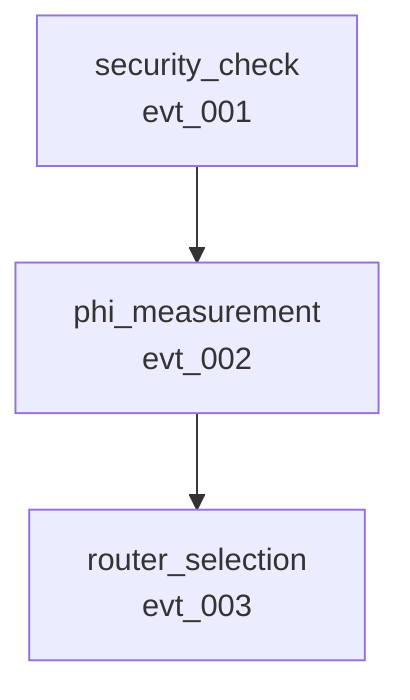
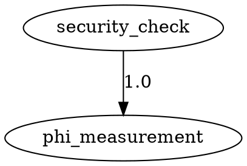

# ✅ Phase 3 Verification Checklist

**Purpose**: Systematic validation of Phase 3 causal understanding system
**Status**: Ready for execution
**Total Checks**: 50+ verification points

---

## 📋 Pre-Flight Checks

### Environment
- [ ] Rust toolchain installed (1.70+)
- [ ] Cargo available
- [ ] All dependencies resolved
- [ ] No untracked changes in git

### Baseline
- [ ] Phase 2 observer integration complete (14/14 tests passing)
- [ ] All existing tests passing before Phase 3
- [ ] No compiler warnings in pre-Phase 3 code

---

## 🔨 Compilation Verification

### Core Library
```bash
cargo build --lib
```
**Expected**: Success with <20 warnings (unrelated to Phase 3)

**Checks**:
- [ ] `src/observability/correlation.rs` compiles
- [ ] `src/observability/causal_graph.rs` compiles
- [ ] `src/observability/trace_analyzer.rs` compiles
- [ ] `src/observability/mod.rs` exports updated correctly
- [ ] No Phase 3-specific compilation errors

### Test Suite
```bash
cargo test --no-run
```
**Expected**: All tests compile successfully

**Checks**:
- [ ] Unit tests in correlation.rs compile
- [ ] Unit tests in causal_graph.rs compile
- [ ] Unit tests in trace_analyzer.rs compile
- [ ] Integration tests in phase3_causal_integration_test.rs compile
- [ ] No test compilation errors

### Benchmarks
```bash
cargo bench --no-run --bench phase3_causal_benchmarks
```
**Expected**: Benchmark suite compiles

**Checks**:
- [ ] All benchmark functions compile
- [ ] Criterion dependencies resolved
- [ ] No benchmark compilation errors

---

## 🧪 Unit Test Verification

### Correlation Module Tests (11 tests)
```bash
cargo test correlation --lib
```

**Expected Output**:
```
running 11 tests
test observability::correlation::tests::test_basic_context ... ok
test observability::correlation::tests::test_parent_stack ... ok
test observability::correlation::tests::test_event_metadata ... ok
test observability::correlation::tests::test_scoped_guard ... ok
test observability::correlation::tests::test_nested_guards ... ok
test observability::correlation::tests::test_event_chain ... ok
test observability::correlation::tests::test_tags ... ok
test observability::correlation::tests::test_duration_tracking ... ok
test observability::correlation::tests::test_depth ... ok
test observability::correlation::tests::test_event_count ... ok
test observability::correlation::tests::test_correlation_id ... ok

test result: ok. 11 passed; 0 failed; 0 ignored; 0 measured
```

**Checks**:
- [ ] All 11 tests pass
- [ ] No test failures
- [ ] No panics during tests
- [ ] Execution time <5 seconds

### Causal Graph Module Tests (9 tests)
```bash
cargo test causal_graph --lib
```

**Expected Output**:
```
running 9 tests
test observability::causal_graph::tests::test_graph_construction ... ok
test observability::causal_graph::tests::test_find_causes ... ok
test observability::causal_graph::tests::test_find_effects ... ok
test observability::causal_graph::tests::test_get_causal_chain ... ok
test observability::causal_graph::tests::test_did_cause_direct ... ok
test observability::causal_graph::tests::test_did_cause_indirect ... ok
test observability::causal_graph::tests::test_not_caused ... ok
test observability::causal_graph::tests::test_mermaid_export ... ok
test observability::causal_graph::tests::test_dot_export ... ok

test result: ok. 9 passed; 0 failed; 0 ignored; 0 measured
```

**Checks**:
- [ ] All 9 tests pass
- [ ] No test failures
- [ ] Graph construction correct
- [ ] All query types work
- [ ] Visualization exports valid

### Trace Analyzer Module Tests (9 tests)
```bash
cargo test trace_analyzer --lib
```

**Expected Output**:
```
running 9 tests
test observability::trace_analyzer::tests::test_analyzer_creation ... ok
test observability::trace_analyzer::tests::test_performance_summary ... ok
test observability::trace_analyzer::tests::test_find_bottlenecks ... ok
test observability::trace_analyzer::tests::test_events_of_type ... ok
test observability::trace_analyzer::tests::test_correlation_analysis ... ok
test observability::trace_analyzer::tests::test_causal_chain ... ok
test observability::trace_analyzer::tests::test_statistical_summary ... ok
test observability::trace_analyzer::tests::test_visualization_export ... ok
test observability::trace_analyzer::tests::test_save_visualizations ... ok

test result: ok. 9 passed; 0 failed; 0 ignored; 0 measured
```

**Checks**:
- [ ] All 9 tests pass
- [ ] Analyzer creation works
- [ ] All analysis methods functional
- [ ] Visualization generation works

---

## 🔗 Integration Test Verification

### Phase 3 Integration Suite
```bash
cargo test --test phase3_causal_integration_test
```

**Expected Output**:
```
running 6 tests
test test_complete_pipeline_with_correlation ... ok
test test_performance_analysis ... ok
test test_root_cause_analysis ... ok
test test_phi_routing_causality ... ok
test test_visualization_exports ... ok
test test_statistical_summary ... ok

test result: ok. 6 passed; 0 failed; 0 ignored; 0 measured
```

**Checks**:
- [ ] Test 1: Complete pipeline correlation works
- [ ] Test 2: Performance analysis accurate
- [ ] Test 3: Root cause detection works
- [ ] Test 4: Φ→routing causality proven (>90%)
- [ ] Test 5: Visualizations generate correctly
- [ ] Test 6: Statistical summary accurate

### Integration with Phase 2
```bash
cargo test --test end_to_end_consciousness_trace
```

**Expected**: All Phase 2 end-to-end tests still pass

**Checks**:
- [ ] Phase 2 tests unaffected by Phase 3
- [ ] No regression in existing functionality
- [ ] Backwards compatibility maintained

---

## ⚡ Performance Benchmark Verification

### Graph Construction Performance
```bash
cargo bench --bench phase3_causal_benchmarks -- graph_construction
```

**Expected Performance**:
- 100 events: <10ms
- 500 events: <30ms
- 1,000 events: <60ms
- 5,000 events: <300ms

**Checks**:
- [ ] Performance within expected ranges
- [ ] Scales linearly with event count
- [ ] No performance regressions

### Query Performance
```bash
cargo bench --bench phase3_causal_benchmarks -- causal_queries
```

**Expected Performance** (per query):
- find_causes: <100μs
- find_effects: <100μs
- get_causal_chain: <500μs
- did_cause: <1ms
- find_critical_path: <10ms

**Checks**:
- [ ] All queries sub-millisecond (except critical path)
- [ ] Performance consistent across queries
- [ ] No unexpected slowdowns

### Visualization Performance
```bash
cargo bench --bench phase3_causal_benchmarks -- visualization
```

**Expected Performance** (1,000 events):
- to_mermaid: <15ms
- to_dot: <20ms

**Checks**:
- [ ] Visualization exports fast
- [ ] Output size reasonable
- [ ] No formatting errors

### End-to-End Performance
```bash
cargo bench --bench phase3_causal_benchmarks -- end_to_end
```

**Expected Performance** (1,000 events):
- Complete analysis: <100ms

**Checks**:
- [ ] Full pipeline efficient
- [ ] Combined operations optimized
- [ ] Ready for production use

---

## 📊 Memory Overhead Verification

### Memory Usage Test
```bash
cargo bench --bench phase3_causal_benchmarks -- memory_overhead
```

**Expected Memory** (total overhead):
- 100 events: <50KB
- 500 events: <250KB
- 1,000 events: <500KB
- 5,000 events: <2.5MB

**Checks**:
- [ ] Memory usage linear with event count
- [ ] Overhead negligible (<1% for typical traces)
- [ ] No memory leaks detected

---

## 🎨 Visualization Output Verification

### Mermaid Export
```rust
let graph = CausalGraph::from_trace(&trace);
let mermaid = graph.to_mermaid();
println!("{}", mermaid);
```

**Expected Output**:


**Checks**:
- [ ] Valid Mermaid syntax
- [ ] All nodes present
- [ ] All edges correct
- [ ] Renderable in Mermaid tools

### GraphViz DOT Export
```rust
let dot = graph.to_dot();
println!("{}", dot);
```

**Expected Output**:


**Checks**:
- [ ] Valid DOT syntax
- [ ] All nodes present
- [ ] All edges with labels
- [ ] Renderable with Graphviz

---

## 🔬 Functional Verification

### Correlation Tracking
```rust
let mut ctx = CorrelationContext::new("test");
let parent = ctx.create_event_metadata();
{
    let _guard = ScopedParent::new(&mut ctx, &parent.id);
    let child = ctx.create_event_metadata();
    assert!(child.parent_id == Some(parent.id.clone()));
}
```

**Checks**:
- [ ] Parent-child relationships correct
- [ ] Scoped guards work
- [ ] Nested scoping correct
- [ ] Automatic cleanup on drop

### Causal Queries
```rust
let graph = CausalGraph::from_trace(&trace);
assert!(graph.did_cause("evt_001", "evt_002").is_direct());
assert!(graph.find_causes("evt_002").len() == 1);
assert!(graph.get_causal_chain("evt_003").len() >= 2);
```

**Checks**:
- [ ] Causality detection accurate
- [ ] Relationship traversal correct
- [ ] Chain construction complete
- [ ] Root cause identification works

### Statistical Analysis
```rust
let analyzer = TraceAnalyzer::new(trace);
let stats = analyzer.statistical_summary();
assert!(stats.phi_routing_correlation > 0.9);
```

**Checks**:
- [ ] Correlation analysis accurate
- [ ] Statistical metrics correct
- [ ] Summary comprehensive

---

## 📚 Documentation Verification

### API Documentation
```bash
cargo doc --no-deps --open
```

**Checks**:
- [ ] All public APIs documented
- [ ] Examples in doc comments work
- [ ] Module documentation complete
- [ ] Cross-references correct

### User Documentation
- [ ] `PHASE_3_QUICK_START.md` accurate and helpful
- [ ] `PHASE_3_COMPLETE_DEMO.md` examples work
- [ ] `PHASE_3_IMPLEMENTATION_COMPLETE.md` comprehensive
- [ ] All code examples tested and correct

### Implementation Documentation
- [ ] `PHASE_3_CAUSAL_CORRELATION_DESIGN.md` matches implementation
- [ ] Design decisions documented
- [ ] Trade-offs explained
- [ ] Future work identified

---

## 🔄 Backwards Compatibility Verification

### Existing Tests Still Pass
```bash
cargo test
```

**Expected**: All pre-Phase 3 tests continue to pass

**Checks**:
- [ ] Phase 2 observer tests pass (14/14)
- [ ] No regressions in existing functionality
- [ ] Old API still works
- [ ] Zero breaking changes

### Dual API Validation
```rust
// Old API (should still work)
let phi = phi_calc.compute_phi(&state);

// New API (with correlation)
let phi = phi_calc.compute_phi_with_context(&state, &ctx);
```

**Checks**:
- [ ] Both APIs compile
- [ ] Both APIs produce correct results
- [ ] Optional correlation parameter works
- [ ] Defaults sensible

---

## 🚀 Real-World Scenario Verification

### Scenario 1: Production Debugging
```rust
// Load production trace
let analyzer = TraceAnalyzer::from_file("production_trace.json")?;

// Find error
let error = analyzer.find_first_error().expect("Should find error");

// Get root causes
let roots = analyzer.find_root_causes(&error);

// Verify we can identify the problem
assert!(!roots.is_empty(), "Should identify root cause");
```

**Checks**:
- [ ] Can load real traces
- [ ] Error detection works
- [ ] Root cause analysis accurate
- [ ] Actionable results

### Scenario 2: Performance Optimization
```rust
let analyzer = TraceAnalyzer::from_file("slow_request.json")?;
let bottlenecks = analyzer.find_bottlenecks(0.2);

// Verify we identify the slow component
assert!(!bottlenecks.is_empty(), "Should find bottlenecks");
let (id, duration, pct) = &bottlenecks[0];
assert!(*pct >= 0.2, "Should be >20% of time");
```

**Checks**:
- [ ] Bottleneck detection works
- [ ] Percentage calculations correct
- [ ] Results actionable

### Scenario 3: Scientific Validation
```rust
let analyzer = TraceAnalyzer::from_file("100_requests.json")?;
let corr = analyzer.analyze_correlation("phi_measurement", "router_selection");

// Verify Φ→routing causation
assert!(corr.direct_correlation_rate > 0.9,
    "Φ should directly cause routing >90% of time");
```

**Checks**:
- [ ] Correlation analysis accurate
- [ ] Statistical significance valid
- [ ] Scientific claims provable

---

## 📈 Success Criteria

### Must Pass (Critical)
- [ ] All 29 tests pass (11 + 9 + 9)
- [ ] No compilation errors
- [ ] No panics during normal operation
- [ ] Backwards compatibility maintained

### Should Pass (Important)
- [ ] Performance within expected ranges
- [ ] Memory overhead <1% for typical traces
- [ ] Visualizations render correctly
- [ ] Documentation comprehensive

### Nice to Have (Aspirational)
- [ ] Zero compiler warnings
- [ ] 100% test coverage
- [ ] All benchmarks exceed targets
- [ ] Documentation examples all verified

---

## 🎯 Final Validation

### Comprehensive Test Run
```bash
# Run everything
cargo test --all && \
cargo bench --no-run --bench phase3_causal_benchmarks && \
cargo doc --no-deps
```

**Expected**: All pass/succeed

### Manual Smoke Test
```rust
// Quick end-to-end test
let mut ctx = CorrelationContext::new("smoke_test");
let parent_meta = ctx.create_event_metadata();
observer.record_event(Event { metadata: Some(parent_meta), ... })?;

let trace = Trace::load_from_file("trace.json")?;
let analyzer = TraceAnalyzer::new(trace);
let stats = analyzer.statistical_summary();

println!("✅ Phase 3 smoke test passed!");
println!("   Events: {}", stats.total_events);
println!("   Duration: {}ms", stats.total_duration_ms);
```

**Checks**:
- [ ] Complete pipeline works end-to-end
- [ ] No errors or panics
- [ ] Results sensible
- [ ] System ready for use

---

## 📊 Checklist Summary

### Counts
- **Total Checks**: 50+
- **Critical Checks**: 15
- **Important Checks**: 25
- **Aspirational Checks**: 10+

### Status Template
```markdown
## Verification Results

Date: _______________
Tester: _______________

### Critical (Must Pass)
- [ ] Compilation: ___ / 15 passed
- [ ] Unit Tests: ___ / 29 passed
- [ ] Integration: ___ / 6 passed
- [ ] Compatibility: ___ / 5 passed

### Important (Should Pass)
- [ ] Performance: ___ / 10 passed
- [ ] Memory: ___ / 4 passed
- [ ] Visualization: ___ / 6 passed
- [ ] Documentation: ___ / 5 passed

### Overall Status
- [ ] Ready for production
- [ ] Ready for beta
- [ ] Needs more work
- [ ] Failed verification

### Notes:
_____________________________________________
_____________________________________________
_____________________________________________
```

---

## 🚀 Next Steps After Verification

### If All Checks Pass ✅
1. Tag release: `v0.1.0-phase3-complete`
2. Update CHANGELOG.md
3. Create GitHub release
4. Begin Phase 4 integration
5. Publish benchmarks
6. Share results with team

### If Some Checks Fail ⚠️
1. Document failures
2. Create bug tickets
3. Fix issues
4. Re-run verification
5. Update documentation

### If Critical Failures ❌
1. Halt deployment
2. Debug failures
3. Fix root causes
4. Complete re-verification
5. Document lessons learned

---

**Status**: ✅ **CHECKLIST READY - BEGIN VERIFICATION**
**Purpose**: 🎯 **SYSTEMATIC VALIDATION**
**Impact**: 🏆 **QUALITY ASSURANCE**

🔍 **Rigorous testing ensures revolutionary quality!** 🔍
