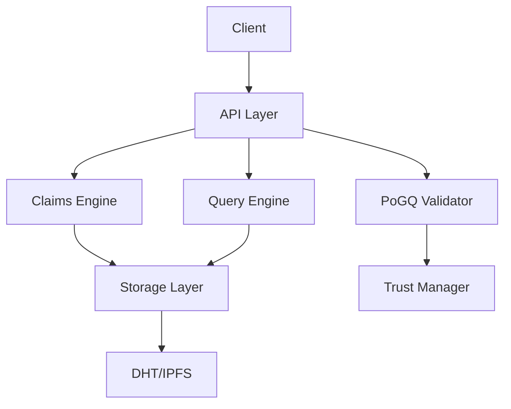

# Phase 3: MVP Completion & Production Readiness

**Goal:** Complete MVP to 100%, add production-grade examples, benchmarks, and documentation
**Target Completion:** 100% MVP + Production readiness
**Timeline:** Current session
**Starting Point:** 90% MVP completion, 141 passing tests

---

## Executive Summary

Phase 3 focuses on completing the MVP and making Mycelix-DeSci production-ready through:
1. **Comprehensive Examples** - Real-world usage demonstrations
2. **Performance Benchmarks** - Scalability validation
3. **Production Documentation** - Architecture, API reference, deployment guides
4. **Quality Assurance** - Integration testing, performance validation

---

## Priority Tasks

### 1. Enhanced Examples (HIGH PRIORITY) ⭐
**Goal:** Demonstrate real-world platform usage
**Estimated LOC:** ~1,500
**Time:** 1-2 hours

#### 1.1 Complete Workflow Example
**File:** `examples/complete_workflow.rs`
**Purpose:** End-to-end demonstration of claim lifecycle
**Features:**
- Create epistemic claim from research data
- Upload to storage with provenance tracking
- Add verifications from multiple peers
- Query claims with complex filters
- Track trust scores
- Demonstrate tier upgrades (E0 → E4)

**Key Code Sections:**
```rust
// 1. Dataset preparation and hashing
// 2. Claim creation with metadata
// 3. Storage integration
// 4. Verification workflow
// 5. Query demonstrations
// 6. Trust score integration
```

#### 1.2 Query System Demo
**File:** `examples/query_demo.rs`
**Purpose:** Showcase advanced query capabilities
**Features:**
- Create sample dataset (50+ claims)
- Category filtering
- Keyword search
- Tier-based filtering
- Pagination
- Sorting (by tier, timestamp)
- Performance metrics

#### 1.3 Trust & Reputation Demo
**File:** `examples/trust_demo.rs`
**Purpose:** Trust layer integration
**Features:**
- Initialize trust manager
- Simulate peer interactions
- Update trust scores
- Demonstrate decay
- Threshold checking
- Multi-participant scenarios

#### 1.4 PoGQ Federated Learning Demo
**File:** `examples/pogq_demo.rs`
**Purpose:** Byzantine-resistant FL demonstration
**Features:**
- Simulate FL round with 10 participants
- 8 honest, 2 Byzantine
- Gradient validation
- Byzantine detection
- Aggregation strategy
- Round-by-round progression

#### 1.5 Python Integration Example
**File:** `examples/python_integration.py`
**Purpose:** Show Python ML integration
**Features:**
- Load Rust library via FFI or subprocess
- Train PyTorch model
- Extract gradients
- Submit to PoGQ validator
- Receive validation results
- Update local model

---

### 2. Performance Benchmarks (HIGH PRIORITY) ⭐
**Goal:** Validate scalability and performance
**Estimated LOC:** ~800
**Time:** 1 hour

#### 2.1 Core Benchmarks
**File:** `benches/core_benchmarks.rs`
**Tool:** Criterion.rs
**Benchmarks:**

1. **Claim Operations**
   - Creation: Target <1μs
   - Serialization: Target <10μs
   - Validation: Target <5μs

2. **Storage Operations**
   - Store: Target <100μs
   - Retrieve: Target <50μs
   - Update: Target <100μs
   - Bulk operations (100 claims): Target <10ms

3. **Query Operations**
   - Index build (1000 claims): Target <5ms
   - Category query: Target <1ms
   - Keyword search: Target <2ms
   - Complex multi-filter: Target <5ms

4. **Hash Operations**
   - BLAKE3 (1MB): Target <5ms
   - SHA-256 (1MB): Target <10ms
   - Merkle tree (1000 hashes): Target <50ms

5. **Trust Operations**
   - Score update: Target <1μs
   - Decay calculation: Target <1μs
   - Threshold check: Target <100ns

#### 2.2 Scaling Benchmarks
**Test Scenarios:**
- 10, 100, 1K, 10K, 100K claims
- Measure query performance degradation
- Memory usage tracking
- Concurrent access (10, 50, 100 threads)

#### 2.3 Performance Report
**File:** `docs/performance/BENCHMARKS.md`
**Content:**
- Benchmark results with charts
- Performance characteristics
- Scaling analysis
- Optimization recommendations

---

### 3. Architecture Documentation (MEDIUM PRIORITY) 📚
**Goal:** Comprehensive system documentation
**Estimated Pages:** ~20
**Time:** 1 hour

#### 3.1 System Architecture
**File:** `docs/architecture/SYSTEM_ARCHITECTURE.md`
**Content:**
- High-level architecture diagram (Mermaid)
- Component overview
- Data flow diagrams
- Integration points
- Technology stack breakdown

**Diagrams:**


#### 3.2 Component Documentation
**File:** `docs/architecture/COMPONENTS.md`
**Sections:**
- Claims module (epistemic tiers, verification)
- Storage layer (backends, abstraction)
- Query engine (indexing, filtering)
- PoGQ validator (Byzantine resistance)
- Trust manager (MATL integration)
- Utilities (validation, serialization)

#### 3.3 Data Models
**File:** `docs/architecture/DATA_MODELS.md`
**Content:**
- DesciClaim structure
- Provenance tracking
- Verification chain
- Trust scores
- Gradient updates

#### 3.4 Security Model
**File:** `docs/architecture/SECURITY.md`
**Content:**
- Threat model
- Byzantine fault tolerance
- Cryptographic primitives
- Access control
- Data integrity
- Privacy considerations

---

### 4. API Reference (MEDIUM PRIORITY) 📖
**Goal:** Complete developer reference
**Time:** 30 min

#### 4.1 Generate Rustdoc
**Command:** `cargo doc --no-deps --document-private-items`
**Enhancements:**
- Add module-level examples
- Cross-reference related types
- Include common patterns

#### 4.2 API Quick Reference
**File:** `docs/api/QUICK_REFERENCE.md`
**Sections:**
- Common imports
- Creating claims
- Storage operations
- Query patterns
- Validation helpers
- Serialization utilities

---

### 5. Workflow Diagrams (LOW PRIORITY) 📊
**Goal:** Visual workflow documentation
**Time:** 30 min

#### 5.1 Claim Lifecycle
**File:** `docs/workflows/CLAIM_LIFECYCLE.md`
**Diagram:** Mermaid sequence diagram
**Stages:**
1. Creation (E0)
2. Storage upload
3. Peer verification
4. Tier upgrade (E1 → E2 → E3 → E4)
5. Query and discovery

#### 5.2 Federated Learning Round
**File:** `docs/workflows/FL_ROUND.md`
**Diagram:** Mermaid flowchart
**Steps:**
1. Global model distribution
2. Local training
3. Gradient extraction
4. PoGQ validation
5. Aggregation
6. Model update

#### 5.3 Trust Score Evolution
**File:** `docs/workflows/TRUST_EVOLUTION.md`
**Diagram:** State transition diagram
**States:**
- New participant (0.5)
- Positive interactions (↑)
- Negative interactions (↓)
- Decay over time (→ 0.5)
- Threshold enforcement

---

## Success Criteria

### Code Quality
- ✅ All tests passing (target: 150+ tests)
- ✅ 80%+ code coverage
- ✅ No compiler warnings
- ✅ Clippy clean
- ✅ Formatted with rustfmt

### Performance
- ✅ Query <5ms for 1K claims
- ✅ Store operation <100μs
- ✅ Hash operation <10ms for 1MB
- ✅ Memory efficient (heap usage monitored)

### Documentation
- ✅ All public APIs documented
- ✅ Architecture diagrams complete
- ✅ 5+ working examples
- ✅ Performance benchmarks published

### Usability
- ✅ Examples run without errors
- ✅ Clear error messages
- ✅ Comprehensive README
- ✅ Quick start guide

---

## Implementation Order

### Session 1 (Current) - Core Completion
1. ✅ Create Phase 3 plan (this document)
2. 🔄 Enhanced examples (complete_workflow, query_demo, trust_demo)
3. 🔄 Performance benchmarks (Criterion setup)
4. 🔄 Architecture documentation (system overview)
5. ✅ Commit and push

### Future Sessions - Polish & Extensions
6. Smart contracts (DesciNFT, ClaimRegistry)
7. Frontend integration
8. Deployment guides
9. CI/CD enhancements

---

## Technical Specifications

### Example Code Standards
- Use realistic data (not "test", "foo", "bar")
- Include error handling
- Show best practices
- Add explanatory comments
- Demonstrate multiple patterns

### Benchmark Standards
- Use Criterion.rs statistical analysis
- Run on isolated CPU core if possible
- Report mean, std dev, min, max
- Include memory profiling
- Compare against baseline

### Documentation Standards
- Mermaid diagrams for visuals
- Code examples in all guides
- Cross-reference between docs
- Keep technical accuracy
- Update with each change

---

## Risk Mitigation

### Performance Risks
- **Risk:** Benchmarks reveal bottlenecks
- **Mitigation:** Profile and optimize hot paths
- **Fallback:** Document limitations, plan optimization

### Documentation Risks
- **Risk:** Docs become outdated
- **Mitigation:** Automate doc tests
- **Fallback:** Version documentation

### Example Risks
- **Risk:** Examples don't compile
- **Mitigation:** Add to CI pipeline
- **Fallback:** Mark as "concept" examples

---

## Metrics & KPIs

### Before Phase 3
- Tests: 141
- LOC: ~10,000
- Examples: 3
- Benchmarks: 0
- Docs: Basic README
- MVP: 90%

### After Phase 3 (Target)
- Tests: 150+
- LOC: ~12,000+
- Examples: 8+
- Benchmarks: 20+
- Docs: Comprehensive (30+ pages)
- MVP: 100% ✅

---

## Next Phase Preview (Phase 4)

After completing MVP, Phase 4 will focus on:
1. **Smart Contracts** - Solidity implementation for IP-NFTs
2. **Frontend** - Svelte/TypeScript UI enhancements
3. **Integration** - Holochain DHT integration
4. **zk-STARKs** - Risc0 integration for proofs
5. **Production Deployment** - Docker, K8s, monitoring

---

## Conclusion

Phase 3 transforms Mycelix-DeSci from a functional MVP to a production-ready platform with:
- **Practical Examples** for developers
- **Performance Validation** for scalability
- **Comprehensive Documentation** for understanding
- **100% MVP Completion** for confidence

Let's build! 🚀
