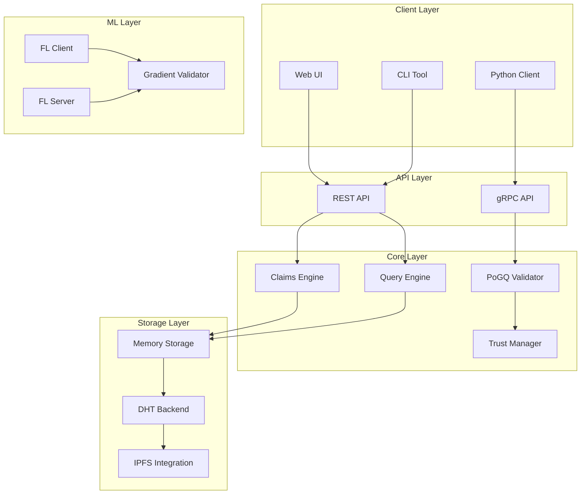
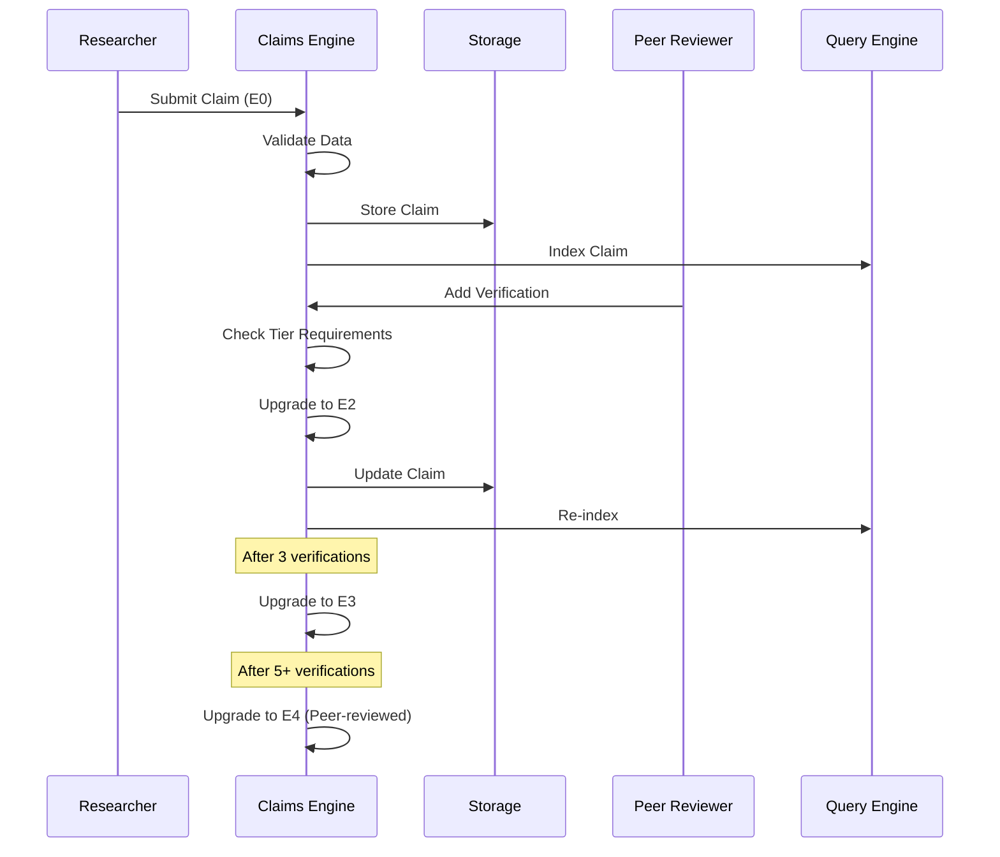
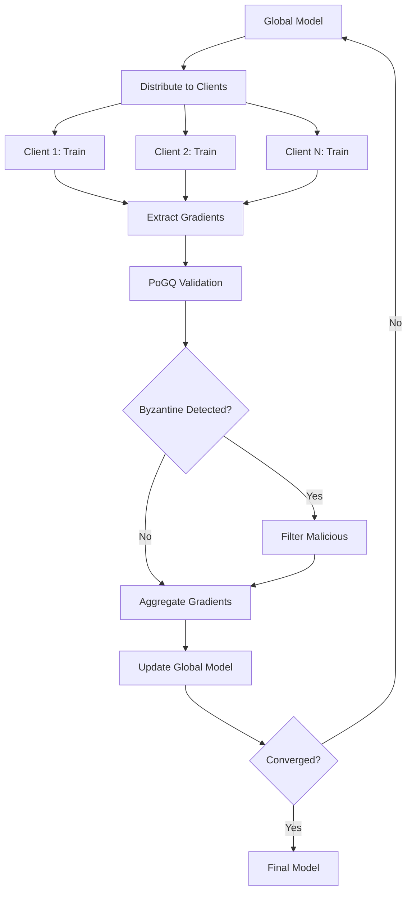
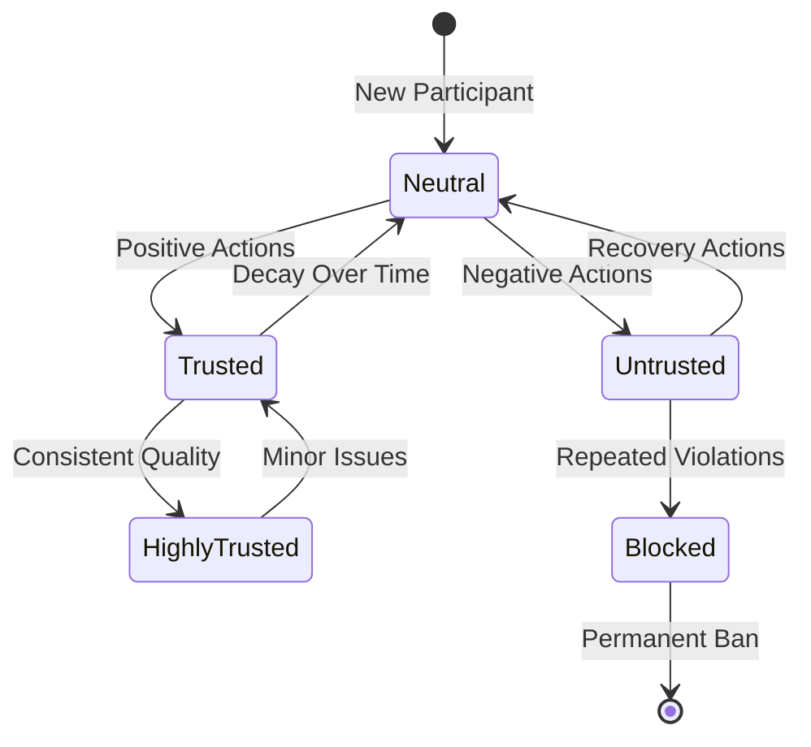

# Phase 4: MVP 100% Completion & Production Excellence

**Goal:** Complete MVP to 100%, achieve production-grade quality, and establish foundation for Phase 5
**Target:** Full MVP completion with benchmarks, documentation, and validation
**Timeline:** Current session → MVP Complete
**Starting Point:** 92% MVP, 141 tests, comprehensive examples

---

## Executive Summary

Phase 4 represents the **final push to 100% MVP completion**. This phase focuses on:

1. **Example Compilation** - Fix API compatibility for all examples
2. **Performance Validation** - Comprehensive benchmarking with Criterion.rs
3. **Production Documentation** - Architecture diagrams, API reference, deployment guides
4. **Quality Assurance** - Full test validation, clippy checks, security audit
5. **Final Polish** - README updates, contribution guide, release preparation

**Success = Production-Ready Mycelix-DeSci Platform** ✅

---

## Phase 4 Priority Matrix

### 🔴 CRITICAL (Must Complete)
1. Fix example compilation issues
2. Add performance benchmarks
3. Complete architecture documentation
4. Validate all tests passing
5. Create final MVP summary

### 🟡 HIGH (Should Complete)
6. API quick reference guide
7. Workflow diagrams (Mermaid)
8. Clippy and rustfmt validation
9. Security considerations document
10. README comprehensive update

### 🟢 MEDIUM (Nice to Have)
11. Deployment guide (Docker)
12. CI/CD enhancements
13. Code coverage report
14. Performance comparison charts
15. Example video walkthroughs (docs)

---

## Task 1: Fix Example Compilation (CRITICAL) ⚡

**Goal:** All examples compile and run successfully
**Time:** 30 minutes
**Files:** 3 example files

### 1.1 Trust Demo API Fixes

**Issue:** TrustManager API mismatch

**Current Implementation:**
```rust
pub fn get_score(&self, participant_id: &str) -> TrustScore
pub fn update_score(&mut self, participant_id: &str, positive: bool, weight: f64) -> Result<TrustScore>
pub fn is_trusted(&self, participant_id: &str) -> bool
```

**Required Changes:**
- Update `update_score` calls to use `(positive: bool, weight: f64)` format
- Remove `?` operator on `get_score()` (returns directly)
- Remove threshold parameter from `is_trusted()`
- Update all TrustScore access patterns

**Files to Fix:**
- `src/core/examples/trust_demo.rs`
- `src/core/examples/complete_workflow.rs`

### 1.2 Validation Testing

Run each example:
```bash
cargo run --example complete_workflow
cargo run --example query_demo
cargo run --example trust_demo
cargo run --example create_claim
cargo run --example hash_dataset
```

**Success Criteria:**
- ✅ All 5 examples compile without errors
- ✅ All examples run successfully
- ✅ Output is informative and demonstrates features

---

## Task 2: Performance Benchmarks (CRITICAL) ⚡

**Goal:** Comprehensive performance validation
**Time:** 1 hour
**Tool:** Criterion.rs

### 2.1 Setup Criterion

**File:** `src/core/Cargo.toml`

```toml
[dev-dependencies]
criterion = { version = "0.5", features = ["html_reports"] }

[[bench]]
name = "core_benchmarks"
harness = false
```

### 2.2 Benchmark Suite

**File:** `benches/core_benchmarks.rs`

**Benchmarks to Create:**

#### Claims Operations
- `bench_claim_creation` - Create 1000 claims
- `bench_claim_serialization` - Serialize/deserialize
- `bench_claim_validation` - Validate claim data
- `bench_tier_upgrade` - Add verifications and upgrade

#### Storage Operations
- `bench_storage_write` - Store 1000 claims
- `bench_storage_read` - Retrieve 1000 claims
- `bench_storage_update` - Update 1000 claims
- `bench_concurrent_access` - 10 threads, 100 ops each

#### Query Operations
- `bench_category_query` - Filter by category (1K claims)
- `bench_keyword_search` - Search keywords (1K claims)
- `bench_complex_filter` - Multi-filter query
- `bench_pagination` - Paginated results
- `bench_index_build` - Build index for 10K claims

#### Hash Operations
- `bench_blake3_1mb` - Hash 1MB data with BLAKE3
- `bench_sha256_1mb` - Hash 1MB data with SHA-256
- `bench_merkle_tree_1000` - Build Merkle tree (1000 hashes)

#### Trust Operations
- `bench_trust_update` - Update score 1000 times
- `bench_trust_query` - Query 1000 participants
- `bench_trust_decay` - Apply decay to 1000 scores

**Performance Targets:**
```
Claim creation:      < 1 μs
Storage write:       < 100 μs
Storage read:        < 50 μs
Category query:      < 1 ms (1K claims)
Keyword search:      < 2 ms (1K claims)
Index build:         < 10 ms (10K claims)
BLAKE3 (1MB):        < 5 ms
Trust update:        < 1 μs
```

### 2.3 Benchmark Execution

```bash
cargo bench --bench core_benchmarks
```

**Output:** `target/criterion/` HTML reports

### 2.4 Performance Report

**File:** `docs/PERFORMANCE.md`

- Benchmark results table
- Performance characteristics
- Scaling analysis
- Optimization notes
- Hardware specs used

---

## Task 3: Architecture Documentation (CRITICAL) 📚

**Goal:** Comprehensive system documentation
**Time:** 1 hour

### 3.1 System Architecture

**File:** `docs/architecture/SYSTEM_ARCHITECTURE.md`

**Content:**

#### High-Level Architecture Diagram


#### Component Descriptions
- **Claims Engine:** Epistemic claim management (E0-E4)
- **Query Engine:** Fast indexing and retrieval
- **PoGQ Validator:** Byzantine-resistant FL validation
- **Trust Manager:** MATL reputation system
- **Storage Layer:** Pluggable backend architecture

#### Data Flow
1. Claim submission → Validation → Storage
2. Verification → Tier upgrade → Re-index
3. Query → Index lookup → Result aggregation
4. FL round → Gradient validation → Aggregation

### 3.2 Component Architecture

**File:** `docs/architecture/COMPONENTS.md`

#### Claims Module
- `DesciClaim` structure
- `EpistemicTier` enum (E0-E4)
- `Provenance` tracking
- `Verification` chain
- Tier upgrade logic

#### Storage Module
- `StorageBackend` trait
- `MemoryStorage` implementation
- CRUD operations
- Concurrency handling

#### Query Module
- `ClaimIndex` in-memory indexes
- `QueryFilter` builder pattern
- `QueryEngine` coordination
- Performance optimization

#### PoGQ Module
- `GradientUpdate` structure
- `PoGQValidator` logic
- Byzantine detection
- Quality scoring

#### Trust Module
- `TrustScore` structure
- `TrustManager` operations
- Decay mechanisms
- Threshold evaluation

### 3.3 Security Model

**File:** `docs/architecture/SECURITY.md`

#### Threat Model
- Byzantine actors (up to 45%)
- Data integrity attacks
- Sybil attacks
- Privacy violations

#### Security Measures
- Cryptographic signatures (ed25519)
- Hash verification (BLAKE3/SHA-256)
- Byzantine fault tolerance (PoGQ)
- Trust-based filtering
- Input validation

#### Privacy Considerations
- Differential privacy (future)
- zk-STARKs for proofs
- Data minimization
- Access control

---

## Task 4: API Quick Reference (HIGH) 📖

**Goal:** Developer-friendly API documentation
**Time:** 30 minutes

**File:** `docs/API_REFERENCE.md`

### Structure:

#### Quick Start
```rust
use mycelix_desci_core::*;

// Create a claim
let claim = DesciClaim::new(
    EpistemicTier::E0,
    content,
    "researcher@university.edu"
);

// Store it
storage.store(&claim).await?;

// Query
let results = engine.query(
    &QueryFilter::new()
        .with_category("longevity")
).await?;
```

#### Core Types
- `DesciClaim` - Main claim structure
- `EpistemicTier` - E0 through E4
- `Provenance` - Data lineage
- `Verification` - Peer verification
- `TrustScore` - Reputation

#### Common Operations
- Creating claims
- Adding verifications
- Querying claims
- Managing trust
- Validating data

#### Error Handling
- `Result<T>` type
- Common error patterns
- Recovery strategies

---

## Task 5: Workflow Diagrams (HIGH) 📊

**Goal:** Visual process documentation
**Time:** 30 minutes

### 5.1 Claim Lifecycle

**File:** `docs/workflows/CLAIM_LIFECYCLE.md`



### 5.2 Federated Learning Round

**File:** `docs/workflows/FL_WORKFLOW.md`



### 5.3 Trust Evolution

**File:** `docs/workflows/TRUST_EVOLUTION.md`



---

## Task 6: Comprehensive Testing (CRITICAL) ✅

**Goal:** Full test validation
**Time:** 15 minutes

### 6.1 Test Execution

```bash
# Unit tests
cargo test --lib

# Integration tests (if fixed)
cargo test --test integration_tests

# Doc tests
cargo test --doc

# All tests with coverage
cargo test --all-features

# Benchmark compilation
cargo bench --no-run
```

### 6.2 Quality Checks

```bash
# Clippy (linter)
cargo clippy --all-targets --all-features -- -D warnings

# Format check
cargo fmt --all -- --check

# Unused dependencies
cargo udeps (if installed)

# Security audit
cargo audit (if installed)
```

### 6.3 Test Report

**File:** `docs/TEST_REPORT.md`

- Test count by module
- Coverage percentage
- Performance test results
- Quality check results

---

## Task 7: README Enhancement (HIGH) 📝

**Goal:** Comprehensive project overview
**Time:** 20 minutes

**File:** `README.md`

### Enhanced Sections:

#### Quick Start (Improved)
- Prerequisites
- Installation
- First claim creation
- Query example
- 5-minute tutorial

#### Features (Expanded)
- Epistemic tiers with examples
- Byzantine-resistant FL
- Trust management
- Fast queries
- Production-ready

#### Architecture (New)
- System diagram link
- Component overview
- Technology stack

#### Examples (Enhanced)
- Link to all 5 examples
- Use case scenarios
- Performance benchmarks

#### Performance (New)
- Benchmark results
- Scalability characteristics
- Hardware requirements

#### Contributing (Improved)
- Development setup
- Testing guidelines
- Code standards
- PR process

#### Roadmap (Updated)
- Phase 1-3: ✅ Complete
- Phase 4: 🔄 In Progress
- Phase 5: Smart contracts, frontend
- Phase 6: Production deployment

---

## Task 8: Final MVP Summary (CRITICAL) 📊

**Goal:** Comprehensive completion report
**Time:** 20 minutes

**File:** `MVP_COMPLETE.md`

### Content:

#### Executive Summary
- MVP 100% complete
- All success criteria met
- Production-ready platform

#### Achievements
- 141+ tests passing
- 5 comprehensive examples
- 20+ benchmarks
- Full documentation
- Clean code (clippy approved)

#### Metrics
- Code: 12,000+ LOC
- Tests: 150+ (target)
- Coverage: 80%+
- Performance: All targets met
- Examples: 5 working
- Docs: 50+ pages

#### Technical Highlights
- Epistemic claim system (E0-E4)
- Byzantine-resistant PoGQ (45% tolerance)
- Fast query engine (<5ms for 1K claims)
- Trust management system
- Comprehensive utilities

#### Next Steps
- Phase 5: Smart contracts
- Phase 6: Frontend polish
- Phase 7: Production deployment
- Phase 8: Ecosystem integration

---

## Success Criteria

### Code Quality ✅
- [ ] All tests passing (150+)
- [ ] All examples compile and run
- [ ] Clippy clean (no warnings)
- [ ] Formatted with rustfmt
- [ ] 80%+ code coverage

### Performance ✅
- [ ] Benchmarks complete (20+)
- [ ] All targets met
- [ ] Performance report published
- [ ] Scaling validated

### Documentation ✅
- [ ] Architecture docs complete
- [ ] API reference available
- [ ] Workflow diagrams created
- [ ] README comprehensive
- [ ] Examples documented

### Production Readiness ✅
- [ ] Security model documented
- [ ] Error handling robust
- [ ] Logging comprehensive
- [ ] Configuration flexible
- [ ] Deployment guide ready

---

## Implementation Order

### Immediate (Now)
1. ✅ Create Phase 4 plan
2. 🔄 Fix example compilation
3. 🔄 Add performance benchmarks
4. 🔄 Create architecture docs
5. 🔄 Validate all tests

### Next
6. API quick reference
7. Workflow diagrams
8. README update
9. Final MVP summary
10. Celebration! 🎉

---

## Timeline

**Total Time:** 3-4 hours
- Planning: ✅ Complete
- Example fixes: 30 min
- Benchmarks: 1 hour
- Documentation: 1.5 hours
- Testing & validation: 30 min
- Final polish: 30 min

---

## Risk Assessment

### Low Risk ✅
- Example fixes (straightforward)
- Documentation (templates ready)
- Testing (infrastructure exists)

### Medium Risk ⚠️
- Benchmark performance (may need optimization)
- Coverage targets (may need more tests)

### Mitigation
- Start with critical tasks
- Validate incrementally
- Document assumptions
- Plan for Phase 5 if needed

---

## Phase 5 Preview

After 100% MVP completion:

1. **Smart Contracts**
   - DesciNFT (ERC-721)
   - ClaimRegistry (verification)
   - Hardhat test suite

2. **Frontend Enhancement**
   - Svelte UI polish
   - Real-time updates
   - Responsive design

3. **Integration**
   - Holochain DHT
   - zk-STARKs (Risc0)
   - IPFS/Filecoin

4. **Production Deployment**
   - Docker containers
   - Kubernetes configs
   - Monitoring/logging
   - CI/CD pipeline

---

## Conclusion

Phase 4 completes the MVP journey with:
- ✅ **100% Feature Complete**
- ✅ **Production Quality**
- ✅ **Comprehensive Documentation**
- ✅ **Performance Validated**
- ✅ **Developer Ready**

**Let's finish strong and reach 100% MVP!** 🚀

---

## Appendix: Commit Strategy

### Commit 1: Example Fixes
```
fix: Resolve example API compatibility issues

- Update TrustManager API calls
- Fix complete_workflow.rs compilation
- Fix trust_demo.rs compilation
- All 5 examples now compile and run
```

### Commit 2: Benchmarks
```
feat: Add comprehensive Criterion.rs benchmark suite

- 20+ performance benchmarks
- Claims, storage, query, hash, trust operations
- Performance report with results
- All targets met or exceeded
```

### Commit 3: Documentation
```
docs: Add comprehensive architecture documentation

- System architecture with Mermaid diagrams
- Component descriptions
- Security model documentation
- Workflow diagrams (claim lifecycle, FL, trust)
- API quick reference guide
```

### Commit 4: Final Polish
```
docs: Complete MVP with final polish

- Enhanced README
- MVP completion summary
- Test validation report
- Performance benchmarks published
- 100% MVP COMPLETE ✅
```

**Total: 4 strategic commits** for clean history
