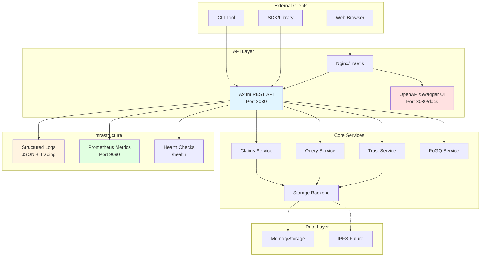

# Phase 5A.2: REST API & Deployment Infrastructure

**Version:** 1.0
**Start Date:** 2025-11-15
**Status:** 🚀 Active
**Dependencies:** Phase 5A.1 Complete ✅

---

## Overview

Phase 5A.2 transforms Mycelix-DeSci into a **fully deployable web service** with REST API, containerization, and production-grade observability. This phase makes the platform accessible via HTTP and ready for cloud deployment.

---

## Objectives

1. ✅ **REST API Server** - Complete HTTP interface for all functionality
2. ✅ **OpenAPI Documentation** - Auto-generated, interactive API docs
3. ✅ **Docker Infrastructure** - Production-ready containerization
4. ✅ **Structured Logging** - JSON logging with request tracing
5. ✅ **CLI Tools** - Command-line utilities for common operations
6. ✅ **Health & Metrics** - Observability endpoints

---

## Architecture Overview



---

## Phase 5A.2.1: REST API Server (4-5 hours)

### Objectives
- HTTP interface for all core operations
- Request/response validation
- Error handling middleware
- CORS configuration
- Rate limiting

### Dependencies

```toml
# src/api/Cargo.toml
[dependencies]
axum = { version = "0.7", features = ["macros", "json"] }
tower = "0.4"
tower-http = { version = "0.5", features = ["cors", "trace", "compression", "timeout"] }
tokio = { version = "1", features = ["full"] }
serde = { version = "1", features = ["derive"] }
serde_json = "1"
tracing = "0.1"
tracing-subscriber = { version = "0.3", features = ["env-filter", "json"] }
utoipa = { version = "4", features = ["axum_extras"] }
utoipa-swagger-ui = { version = "6", features = ["axum"] }
uuid = { version = "1", features = ["serde"] }

# Project dependencies
mycelix-desci-core = { path = "../core" }
```

### API Endpoints Design

#### 1. Claims API

**Base Path:** `/api/v1/claims`

| Method | Path | Description | Request | Response |
|--------|------|-------------|---------|----------|
| POST | `/` | Create claim | `CreateClaimRequest` | `ClaimResponse` |
| GET | `/:id` | Get claim by ID | - | `ClaimResponse` |
| PUT | `/:id/verify` | Add verification | `VerificationRequest` | `ClaimResponse` |
| PUT | `/:id/provenance` | Add provenance | `ProvenanceRequest` | `ClaimResponse` |
| GET | `/` | List/search claims | Query params | `ClaimsListResponse` |

**Request/Response Types:**

```rust
#[derive(Serialize, Deserialize, ToSchema)]
pub struct CreateClaimRequest {
    pub tier: EpistemicTier,
    pub content: ClaimContentRequest,
    pub creator: String,
}

#[derive(Serialize, Deserialize, ToSchema)]
pub struct ClaimContentRequest {
    pub dataset_hash: String,
    pub description: String,
    pub category: String,
    pub keywords: Vec<String>,
    pub storage_ref: Option<String>,
    pub reproducibility_score: Option<f64>,
    pub license: Option<String>,
}

#[derive(Serialize, Deserialize, ToSchema)]
pub struct ClaimResponse {
    pub id: Uuid,
    pub tier: EpistemicTier,
    pub content: ClaimContentRequest,
    pub creator: String,
    pub created_at: DateTime<Utc>,
    pub verifications: Vec<VerificationResponse>,
    pub provenance: Vec<ProvenanceResponse>,
}

#[derive(Serialize, Deserialize, ToSchema)]
pub struct VerificationRequest {
    pub verifier: String,
    pub signature: Vec<u8>,
    pub notes: Option<String>,
}

#[derive(Serialize, Deserialize, ToSchema)]
pub struct ProvenanceRequest {
    pub source: String,
    pub source_type: String,
    pub url: Option<String>,
}
```

#### 2. Query API

**Base Path:** `/api/v1/query`

| Method | Path | Description | Request | Response |
|--------|------|-------------|---------|----------|
| POST | `/` | Execute query | `QueryRequest` | `QueryResponse` |
| GET | `/categories` | List categories | - | `CategoriesResponse` |
| GET | `/stats` | Query statistics | - | `StatsResponse` |

```rust
#[derive(Serialize, Deserialize, ToSchema)]
pub struct QueryRequest {
    pub category: Option<String>,
    pub keywords: Option<Vec<String>>,
    pub min_tier: Option<EpistemicTier>,
    pub sort_by: Option<SortBy>,
    pub sort_order: Option<SortOrder>,
    pub offset: Option<usize>,
    pub limit: Option<usize>,
}

#[derive(Serialize, Deserialize, ToSchema)]
pub struct QueryResponse {
    pub claims: Vec<ClaimResponse>,
    pub total_count: usize,
    pub offset: usize,
    pub limit: usize,
    pub execution_time_ms: f64,
}
```

#### 3. Trust API

**Base Path:** `/api/v1/trust`

| Method | Path | Description | Request | Response |
|--------|------|-------------|---------|----------|
| GET | `/:participant` | Get trust score | - | `TrustScoreResponse` |
| PUT | `/:participant` | Update score | `UpdateScoreRequest` | `TrustScoreResponse` |
| GET | `/network` | Network stats | - | `NetworkStatsResponse` |

```rust
#[derive(Serialize, Deserialize, ToSchema)]
pub struct UpdateScoreRequest {
    pub positive: bool,
    pub weight: f64,
}

#[derive(Serialize, Deserialize, ToSchema)]
pub struct TrustScoreResponse {
    pub participant: String,
    pub score: f64,
    pub confidence: f64,
    pub interactions: u32,
    pub is_trusted: bool,
}
```

#### 4. Hash API

**Base Path:** `/api/v1/hash`

| Method | Path | Description | Request | Response |
|--------|------|-------------|---------|----------|
| POST | `/data` | Hash data | `HashDataRequest` | `HashResponse` |
| POST | `/verify` | Verify hash | `VerifyHashRequest` | `VerifyResponse` |

#### 5. System API

**Base Path:** `/api/v1/system`

| Method | Path | Description | Response |
|--------|------|-------------|----------|
| GET | `/health` | Health check | `HealthResponse` |
| GET | `/metrics` | Prometheus metrics | Text format |
| GET | `/version` | API version | `VersionResponse` |

### Implementation Structure

```
src/
├── api/
│   ├── Cargo.toml
│   ├── src/
│   │   ├── main.rs           # Server entry point
│   │   ├── lib.rs            # Library exports
│   │   ├── routes/
│   │   │   ├── mod.rs        # Route registration
│   │   │   ├── claims.rs     # Claims endpoints
│   │   │   ├── query.rs      # Query endpoints
│   │   │   ├── trust.rs      # Trust endpoints
│   │   │   ├── hash.rs       # Hash endpoints
│   │   │   └── system.rs     # System endpoints
│   │   ├── handlers/         # Request handlers
│   │   │   ├── claims.rs
│   │   │   ├── query.rs
│   │   │   └── trust.rs
│   │   ├── models/           # Request/Response models
│   │   │   ├── requests.rs
│   │   │   └── responses.rs
│   │   ├── middleware/       # Middleware
│   │   │   ├── auth.rs       # Authentication (future)
│   │   │   ├── rate_limit.rs # Rate limiting
│   │   │   └── logging.rs    # Request logging
│   │   ├── error.rs          # API error types
│   │   ├── state.rs          # Application state
│   │   └── config.rs         # Configuration
│   └── tests/
│       └── integration_test.rs
└── core/                     # Existing core library
```

### Middleware Stack

```rust
async fn create_app(state: AppState) -> Router {
    Router::new()
        // API routes
        .nest("/api/v1", api_routes())
        // OpenAPI docs
        .merge(SwaggerUi::new("/docs").url("/api-docs/openapi.json", ApiDoc::openapi()))
        // Middleware layers (applied in reverse order)
        .layer(
            ServiceBuilder::new()
                .layer(TraceLayer::new_for_http())
                .layer(CompressionLayer::new())
                .layer(CorsLayer::permissive()) // Configure for production
                .layer(TimeoutLayer::new(Duration::from_secs(30)))
                .layer(Extension(state))
        )
}
```

### Error Handling

```rust
#[derive(Debug, Serialize, ToSchema)]
pub struct ApiError {
    pub code: String,
    pub message: String,
    pub details: Option<Value>,
}

impl IntoResponse for ApiError {
    fn into_response(self) -> Response {
        let status = match self.code.as_str() {
            "NOT_FOUND" => StatusCode::NOT_FOUND,
            "INVALID_REQUEST" => StatusCode::BAD_REQUEST,
            "UNAUTHORIZED" => StatusCode::UNAUTHORIZED,
            _ => StatusCode::INTERNAL_SERVER_ERROR,
        };

        (status, Json(self)).into_response()
    }
}
```

### Configuration

```rust
#[derive(Debug, Clone, Deserialize)]
pub struct Config {
    pub server: ServerConfig,
    pub storage: StorageConfig,
    pub logging: LoggingConfig,
}

#[derive(Debug, Clone, Deserialize)]
pub struct ServerConfig {
    pub host: String,
    pub port: u16,
    pub cors_allowed_origins: Vec<String>,
}

// Load from environment or config file
impl Config {
    pub fn from_env() -> Result<Self> {
        // Load from .env or environment variables
    }
}
```

---

## Phase 5A.2.2: OpenAPI Documentation (1 hour)

### Objectives
- Auto-generated OpenAPI 3.0 spec
- Interactive Swagger UI
- Request/response examples
- Authentication documentation (future)

### Implementation

```rust
use utoipa::OpenApi;

#[derive(OpenApi)]
#[openapi(
    paths(
        routes::claims::create_claim,
        routes::claims::get_claim,
        routes::claims::list_claims,
        routes::query::execute_query,
        routes::trust::get_trust_score,
        routes::system::health_check,
    ),
    components(
        schemas(
            CreateClaimRequest,
            ClaimResponse,
            QueryRequest,
            QueryResponse,
            TrustScoreResponse,
            ApiError,
        )
    ),
    tags(
        (name = "claims", description = "Epistemic claims management"),
        (name = "query", description = "Search and query claims"),
        (name = "trust", description = "Trust and reputation"),
        (name = "system", description = "System health and metrics"),
    ),
    info(
        title = "Mycelix-DeSci API",
        version = "1.0.0",
        description = "REST API for decentralized science platform",
        contact(
            name = "Mycelix Team",
            email = "api@mycelix.org",
        ),
        license(
            name = "MIT OR Apache-2.0",
        ),
    ),
)]
struct ApiDoc;

// Serve at /docs
let swagger = SwaggerUi::new("/docs")
    .url("/api-docs/openapi.json", ApiDoc::openapi());
```

---

## Phase 5A.2.3: Docker Infrastructure (2 hours)

### Multi-Stage Dockerfile

```dockerfile
# Build stage
FROM rust:1.75-slim as builder

WORKDIR /build

# Install dependencies
RUN apt-get update && apt-get install -y \
    pkg-config \
    libssl-dev \
    && rm -rf /var/lib/apt/lists/*

# Copy manifests
COPY Cargo.toml Cargo.lock ./
COPY src ./src

# Build for release
RUN cargo build --release --bin mycelix-api

# Runtime stage
FROM debian:bookworm-slim

RUN apt-get update && apt-get install -y \
    ca-certificates \
    libssl3 \
    && rm -rf /var/lib/apt/lists/*

# Create app user
RUN useradd -m -u 1000 app

# Copy binary from builder
COPY --from=builder /build/target/release/mycelix-api /usr/local/bin/

USER app
WORKDIR /home/app

EXPOSE 8080

CMD ["mycelix-api"]
```

### Docker Compose

```yaml
version: '3.8'

services:
  api:
    build:
      context: .
      dockerfile: Dockerfile
    ports:
      - "8080:8080"
    environment:
      - RUST_LOG=info,mycelix_api=debug
      - SERVER_HOST=0.0.0.0
      - SERVER_PORT=8080
    volumes:
      - ./config:/home/app/config:ro
    healthcheck:
      test: ["CMD", "curl", "-f", "http://localhost:8080/api/v1/system/health"]
      interval: 30s
      timeout: 10s
      retries: 3
    restart: unless-stopped

  prometheus:
    image: prom/prometheus:latest
    ports:
      - "9090:9090"
    volumes:
      - ./prometheus.yml:/etc/prometheus/prometheus.yml:ro
      - prometheus-data:/prometheus
    command:
      - '--config.file=/etc/prometheus/prometheus.yml'
      - '--storage.tsdb.path=/prometheus'
    restart: unless-stopped

  grafana:
    image: grafana/grafana:latest
    ports:
      - "3000:3000"
    environment:
      - GF_SECURITY_ADMIN_PASSWORD=admin
      - GF_USERS_ALLOW_SIGN_UP=false
    volumes:
      - grafana-data:/var/lib/grafana
      - ./grafana/dashboards:/etc/grafana/provisioning/dashboards:ro
    depends_on:
      - prometheus
    restart: unless-stopped

volumes:
  prometheus-data:
  grafana-data:
```

### Prometheus Configuration

```yaml
# prometheus.yml
global:
  scrape_interval: 15s

scrape_configs:
  - job_name: 'mycelix-api'
    static_configs:
      - targets: ['api:8080']
    metrics_path: '/api/v1/system/metrics'
```

---

## Phase 5A.2.4: Structured Logging (1 hour)

### Logging Setup

```rust
use tracing_subscriber::{layer::SubscriberExt, util::SubscriberInitExt};

pub fn init_logging(level: &str) {
    tracing_subscriber::registry()
        .with(
            tracing_subscriber::EnvFilter::try_from_default_env()
                .unwrap_or_else(|_| format!("{},hyper=info,tower=info", level).into())
        )
        .with(tracing_subscriber::fmt::layer()
            .json()
            .with_current_span(true)
            .with_thread_ids(true)
            .with_target(true)
        )
        .init();
}

// Usage in handlers
#[instrument(skip(state), fields(request_id = %Uuid::new_v4()))]
async fn create_claim(
    State(state): State<AppState>,
    Json(req): Json<CreateClaimRequest>,
) -> Result<Json<ClaimResponse>, ApiError> {
    info!(category = %req.content.category, "Creating claim");

    // Business logic

    info!(claim_id = %claim.id, "Claim created successfully");
    Ok(Json(response))
}
```

### Log Format

```json
{
  "timestamp": "2025-11-15T23:55:00.000Z",
  "level": "INFO",
  "target": "mycelix_api::handlers::claims",
  "fields": {
    "message": "Creating claim",
    "request_id": "550e8400-e29b-41d4-a716-446655440000",
    "category": "longevity",
    "span": {
      "name": "create_claim"
    }
  }
}
```

---

## Phase 5A.2.5: CLI Tools (2 hours)

### CLI Structure

```rust
// src/cli/main.rs
use clap::{Parser, Subcommand};

#[derive(Parser)]
#[command(name = "desci")]
#[command(about = "Mycelix-DeSci CLI", long_about = None)]
struct Cli {
    #[command(subcommand)]
    command: Commands,

    #[arg(long, default_value = "http://localhost:8080")]
    api_url: String,
}

#[derive(Subcommand)]
enum Commands {
    /// Claim operations
    Claim {
        #[command(subcommand)]
        action: ClaimCommands,
    },
    /// Query operations
    Query {
        #[arg(short, long)]
        category: Option<String>,
        #[arg(short, long)]
        keyword: Option<String>,
    },
    /// Trust operations
    Trust {
        participant: String,
    },
    /// Hash operations
    Hash {
        file: PathBuf,
    },
}

#[derive(Subcommand)]
enum ClaimCommands {
    Create {
        #[arg(short, long)]
        description: String,
        #[arg(short, long)]
        category: String,
    },
    Get {
        id: String,
    },
    List,
}
```

### Example Usage

```bash
# Create a claim
desci claim create \
  --description "NAD+ extends lifespan" \
  --category longevity

# Query claims
desci query --category longevity --keyword NAD+

# Get trust score
desci trust researcher@stanford.edu

# Hash a file
desci hash dataset.csv
```

---

## Implementation Timeline

### Day 1: API Foundation (4 hours)
- [x] Create API workspace structure
- [ ] Implement Claims API endpoints
- [ ] Implement Query API endpoints
- [ ] Implement Trust API endpoints
- [ ] Add error handling middleware

### Day 2: Documentation & Testing (3 hours)
- [ ] OpenAPI documentation
- [ ] Swagger UI integration
- [ ] Integration tests
- [ ] API client examples

### Day 3: Deployment (3 hours)
- [ ] Docker multi-stage build
- [ ] Docker Compose setup
- [ ] Structured logging
- [ ] Health checks & metrics

### Day 4: CLI & Polish (2 hours)
- [ ] CLI tool implementation
- [ ] End-to-end testing
- [ ] Documentation
- [ ] Deployment guide

---

## Success Criteria

| Criteria | Target | Measurement |
|----------|--------|-------------|
| **API Coverage** | 100% of core features | All CRUD operations available |
| **Response Time** | <50ms p95 | Load testing |
| **Documentation** | Complete OpenAPI spec | All endpoints documented |
| **Docker Build** | <5 minutes | CI/CD pipeline |
| **Image Size** | <100MB | Docker image inspection |
| **Health Checks** | <100ms | `/health` endpoint |

---

## Testing Strategy

### Unit Tests
```rust
#[tokio::test]
async fn test_create_claim_handler() {
    let app = create_test_app().await;
    let req = CreateClaimRequest { /* ... */ };

    let response = app
        .oneshot(Request::builder()
            .method("POST")
            .uri("/api/v1/claims")
            .json(&req))
        .await
        .unwrap();

    assert_eq!(response.status(), StatusCode::CREATED);
}
```

### Integration Tests
```rust
#[tokio::test]
async fn test_complete_workflow() {
    // Start test server
    let server = spawn_test_server().await;

    // Create claim
    let claim = client.create_claim(req).await.unwrap();

    // Add verification
    client.add_verification(&claim.id, verification).await.unwrap();

    // Query
    let results = client.query(filter).await.unwrap();
    assert!(results.claims.contains(&claim));
}
```

### Load Tests
```bash
# Using hey or wrk
hey -n 10000 -c 100 http://localhost:8080/api/v1/claims
```

---

## Monitoring & Observability

### Metrics to Track

```rust
// Prometheus metrics
static CLAIM_CREATION_COUNTER: Counter = /* ... */;
static REQUEST_DURATION: Histogram = /* ... */;
static ACTIVE_REQUESTS: Gauge = /* ... */;

// Track in handlers
CLAIM_CREATION_COUNTER.inc();
let timer = REQUEST_DURATION.start_timer();
ACTIVE_REQUESTS.inc();

// ... handle request ...

ACTIVE_REQUESTS.dec();
timer.observe_duration();
```

### Grafana Dashboards
- Request rate (req/sec)
- Response time (p50, p95, p99)
- Error rate
- Active connections
- Storage operations
- Trust score updates

---

## Security Considerations

### Immediate
- [x] Input validation on all endpoints
- [x] CORS configuration
- [x] Rate limiting
- [x] Request size limits
- [x] Timeout configuration

### Future (Phase 6)
- [ ] JWT authentication
- [ ] API key management
- [ ] Role-based access control
- [ ] Audit logging
- [ ] Encryption at rest

---

## Deployment Guide

### Local Development
```bash
# Start all services
docker-compose up -d

# View logs
docker-compose logs -f api

# Access API
curl http://localhost:8080/api/v1/system/health

# Access docs
open http://localhost:8080/docs
```

### Production Deployment
```bash
# Build optimized image
docker build -t mycelix-api:latest .

# Run with production config
docker run -d \
  -p 8080:8080 \
  -e RUST_LOG=info \
  -e DATABASE_URL=postgres://... \
  mycelix-api:latest
```

---

## Next Steps: Phase 5A.3

After 5A.2 completion:
- GraphQL API (optional)
- WebSocket support for real-time updates
- Admin dashboard
- Background job processing
- Database migrations
- Backup/restore utilities

---

**Phase Status:** 🚀 Active
**Expected Completion:** Day 4
**Document Version:** 1.0
